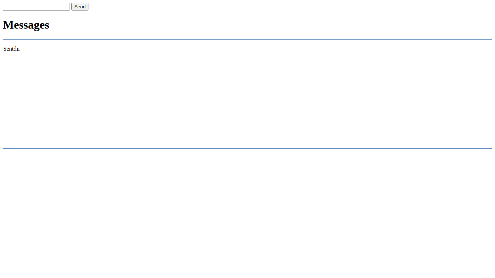
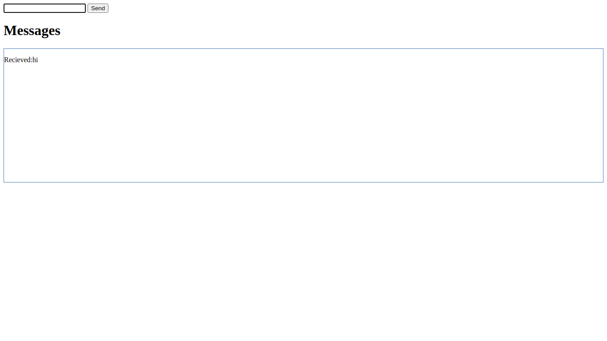

# broadcastchannel-demo

This is demo of `BroadcastChannel` api. It demonstrate how you can communicate between two different browser tabs.

# How to use

* Run command - `npm install`
* Run command - `npm run dev`
* Open expose url in two tabs, generally it would be in [http://localhost:8080/](http://localhost:8080/) 
* Send a message from one tab
* You will see message is recieved in another tab

## Sent

## Recieved

